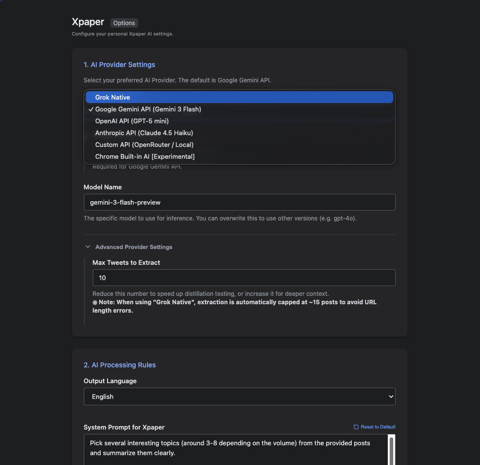

# Xpaper

[](./SECURITY-REVIEW.md)

<p float="left">
  
  
</p>

Xpaper is a Chrome extension that curates and summarizes your X (Twitter) timeline into a clean, readable newsletter format using various LLM providers (Google Gemini, Anthropic Claude, OpenAI, or custom APIs).

This project adheres to rigorous security standards. The entire codebase and architecture have been aggressively audited and hardened by multiple advanced AI models. Vulnerabilities such as XSS, DNS Rebinding, and plaintext credential storage have been systematically eliminated. 

For detailed audit methodology and current security status, refer to [SECURITY-REVIEW.md](./SECURITY-REVIEW.md).

## Prerequisites
- Node.js (v18 or higher recommended)
- Bun (or npm/yarn)
- Google Chrome

## Installation and Setup

```bash
# 1. Clone the repository
git clone https://github.com/laiso/xpaper.git
cd xpaper

# 2. Install dependencies (Bun is recommended)
bun install

# 3. Build the extension
bun run build
```

## Loading the Extension in Chrome

1. Open Chrome and navigate to `chrome://extensions/`.
2. Enable "Developer mode" in the top right.
3. Click "Load unpacked" and select the generated `dist` folder.

## Development

To run the development server with Hot Module Replacement (HMR):
bun run dev

To run tests:
bun run test

## Configuration

After loading the extension, click on the Xpaper extension icon or open the Options page to configure:
1. Your preferred AI Provider (e.g. Gemini, Anthropic, Custom OpenRouter API)
2. Your API Key for the selected provider.
3. Output language and custom summarization prompts.

Note: Xpaper relies on your local browser state and does not store your timeline data on any external servers. LLM inference requires a valid API key unless you are using experimental Chrome Built-in AI features or a **Local LLM**.

## Local LLM Support

Xpaper can connect to local LLM servers like [Ollama](https://ollama.com/) or [LM Studio](https://lmstudio.ai/).

To use a local LLM, set the provider to **Custom API Base URL** in the options.

### Ollama Setup
Launch Ollama with the `OLLAMA_ORIGINS` environment variable to allow the extension to communicate:
```bash
OLLAMA_ORIGINS="chrome-extension://*" ollama serve
```
- **Base URL**: `http://localhost:11434/v1/chat/completions` (or use `.local` addresses for cross-machine access)
- **API Key**: (leave empty)

### LM Studio Setup
1. Open LM Studio and navigate to the **Local Server** (↔) tab.
2. Enable **CORS** and set the Network Address to **Local Network (0.0.0.0)** if accessing from another machine.
3. Start the server.
- **Base URL**: `http://<your-ip>:1234/v1/chat/completions`
- **API Key**: (leave empty)

### Cross-Machine Access
If running the LLM on a different machine (e.g., a Windows PC with a GPU), use mDNS hostnames (e.g., `http://ollama.local:11434/...` or `http://lmstudio.local:1234/...`). Xpaper is configured to allow `.local` and Private IP (RFC 1918) communication by default.
